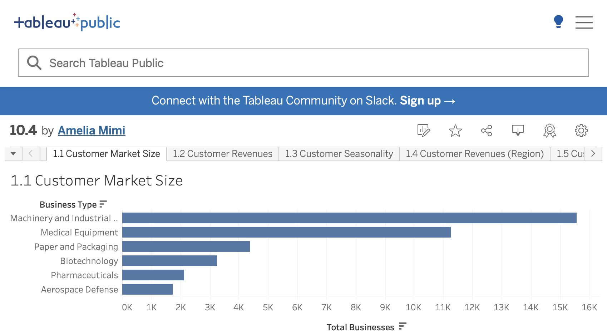

# 📊 Customer Profitability & Divestment Dashboard

Hey there! 👋 This is a Tableau dashboard I built to explore customer and product profitability across different industries. The goal? Help businesses spot which areas are worth investing in — and which ones might be dragging things down.

🔗 [View the Dashboard on Tableau Public](https://public.tableau.com/app/profile/amelia.mimi/viz/10_4_17426764337730/3_3CustomerDivestment)  
📁 File included: `10.4.twbx` (Tableau workbook)

---

## 💡 What This Dashboard Covers

### 🏪 Market Overview
- **Customer Market Size** – See how many businesses are in each sector
- **Revenue Breakdown** – By product, region, and industry
- **Seasonality Trends** – Spot monthly sales patterns and anomalies

### 📈 Profit & Growth
- **Total Profit by Business Type** – Where the revenue is concentrated
- **Average Profit Margin** – Efficiency by industry
- **Market Growth vs. Margin** – Helps prioritize strategic focus

### ⚠️ Divestment Analysis
- **Industries** – Identify underperformers
- **Chemicals** – Analyze product-level profitability
- **Customers** – Pinpoint negative-margin accounts

---

## 🛠 Tools Used
- Tableau Public
- Exploratory Data Analysis
- Visual storytelling
- Business KPI reporting

---

## 🧠 Key Takeaways
- Some industries (like Paper & Packaging) generate revenue but with low efficiency
- Growth and margin don’t always align — both matter
- Identifying low-profit customers and products can guide smarter business decisions

---

## 🙋‍♀️ About Me
Hi! I’m Amelia — an aspiring data analyst who loves turning raw data into clear, actionable insights.  
🔗 [GitHub Profile](https://github.com/AmeliaMimi)

---

## 💾 Try It Out
- View the interactive dashboard on [Tableau Public](https://public.tableau.com/app/profile/amelia.mimi/viz/10_4_17426764337730/3_3CustomerDivestment)
- Or download the `10.4.twbx` file and explore it in Tableau Desktop

Thanks for checking out my project! 😊

